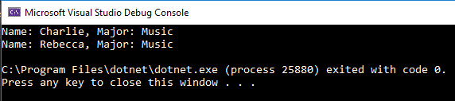

# Basic LINQ Query

This program demonstrates how to use a LINQ query on a list of objects, to return only those that met a specified criteria.

# Query Results

# Author

* *James Hiegel*

[Return to top](../README.md)